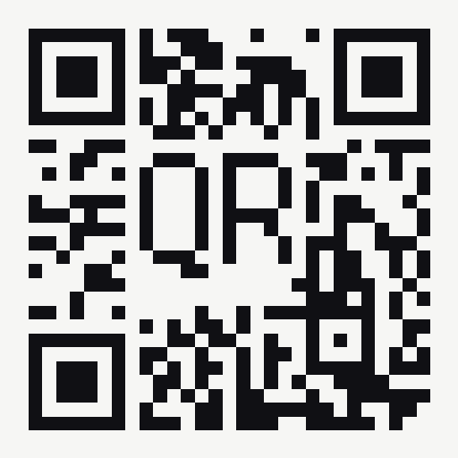

# QartText

QR codes with the domain name, phone number or network name written legibly
inside them, in a bitmap font, and **without spending any of the
error-correction redundancy**.

Named for Russ Cox's [QArt codes](https://research.swtch.com/qart), the
construction it is built on, with text in place of the picture.

Live app: open `index.html` from any static web server or go to
[qarttext.pages.dev](https://qarttext.pages.dev/). It is a progressive web
app with no external dependencies, no build step, and no network calls.

```
python3 -m http.server 8000     # then visit http://localhost:8000/
```



## Kinds of Code

| Kind | Encodes | Drawn Text |
| --- | --- | --- |
| URL | `https://example.com/` | the host name |
| Phone | `tel:+15551234567` | the number as you typed it, `+1(555)123-4567` |
| Wi-Fi | `WIFI:T:WPA;S:Free WiFi;P:Swordfish;;` | the network name |

Only the payload builder and the label differ; the encoder, solver, placement
and fonts are shared, and none of them needed changing to add a kind.

The Wi-Fi format separates fields with semicolons and keys from values with
colons, so `\ ; , : "` must be escaped inside a value. Getting that wrong does
not produce a broken code. It produces one that scans perfectly and silently
truncates the password at the first semicolon, or joins the wrong network. The
builder escapes them, quotes values that would otherwise read as hex, and the
tests round-trip every payload back through an independent parser.

A Wi-Fi code carries the password in clear text: anyone who scans or photographs
it can join the network. The app says so next to the fields.

The fonts cover printable ASCII. Anything outside it (accented letters, other
scripts, emoji) draws as `?`. That affects only the label; the payload is
always encoded exactly.

## Implementation Details

This is Russ Cox's [QArt](https://research.swtch.com/qart) construction, with
text as the artwork instead of an image.

The trick is that a QR code is a linear object:

- Reed–Solomon encoding is linear over GF(256);
- splitting into blocks and interleaving them is a permutation;
- the mask is a fixed XOR.

Compose those and the map from *data bits* to *module colors* is affine
over GF(2).

The URL occupies the first few hundred data bits: a 4-bit mode indicator, a
length field, the payload itself, then a 4-bit terminator. Everything after
that terminator is padding, and a conforming decoder never looks at it. It
reads exactly the declared number of bytes and stops. So every padding bit is a
free variable.

Write one matrix column per free bit and one row per module you want to control,
then run Gauss–Jordan elimination over GF(2). The solution is a Reed–Solomon
codeword that simultaneously spells out the URL and paints the picture.

Cox bought his free bits by appending random characters to the URL's `#` fragment. Taking them from the
padding instead adds nothing to the URL at all: what is encoded is what you
typed, character for character, unless you turn on alphanumeric encoding, which
folds case and nothing else.

### Key Assumption

The technique rests on decoders stopping at the terminator and ignoring the
padding. ZXing-lineage readers do this, and the app pins the terminator
to `0000` so a decoder should not mistake the random padding for another data
segment.

### Limitations

Where a module happens to carry a bit of the URL itself, it cannot be moved;
those pixels come out wherever the URL puts them. The app reports the count as
*fidelity*, searches symbol sizes and vertical positions to minimize it, and
always protects the letterforms ahead of the plate behind them. At levels L and
M the letterforms are typically exact. At level H, where free bits are scarce,
expect a handful of stuck pixels; the card tells you how many before you pick it.

Clearance interacts with this: a smaller clearance lets the text fit in a
smaller symbol, and a smaller symbol has fewer free bits. Raising clearance
often costs you a larger code but buys back fidelity.

## Options

| Control | Effect |
| --- | --- |
| Error correction | `L` leaves the most room for artwork, `H` the least. `M` is a good default. |
| Maximum lines | How many lines the text may wrap onto, up to 5. Breaks are taken at a space, or after a dot or a hyphen. Two is plenty for a domain; a phrase in the override wants more. |
| Clearance | Rings of whitespace between the letterforms and the surrounding noise. Half steps allowed. Default 2. |
| Text override | Draw something other than the default label. |
| Alphanumeric encoding | Encode the address in capitals to buy a denser mode, where that is safe. On by default. |

Three fonts, all authored for this project, times four styles make the twelve
variants, laid out as a grid with fonts named across the top and styles running
down. The styles are not labeled: plate against halo, and upright against
inverted, are plain from the pictures, and on a phone a column of labels costs
more width than the codes. Each card carries its own name for a screen reader
or a hover instead. The fonts are
`Micro 3×5` and `Pixel 5×7`, which hold a single case, and `Mixed 5×8`, which
has real upper and lower case with descenders. The styles cross two choices:
how far the forced region extends, and which way round the letters run:

|  | upright | inverted |
| --- | --- | --- |
| **Plate**: a filled rectangle behind the text | light plate, dark letters | dark plate, light letters |
| **Halo**: clearance around the strokes only, noise beyond | light clearance, dark letters | dark clearance, light letters |

Whitespace is what makes the text readable, far more than the choice of font.
Clearance of 1 leaves the letterforms fighting the surrounding noise.

Clearance takes half steps. A clearance of 2½ means two rings cleared
completely and a third cleared only in part: an ordered 4×4 Bayer threshold
picks half the modules of that outer ring to force light and leaves the rest to
whatever the solver puts there. The edge then fades into the surrounding noise
instead of stopping dead, and the partial ring costs about half the forced
modules of a whole one, roughly 8% fewer across the whole layout, which
matters when free bits are scarce.

It buys texture: the box still extends by the full outer ring, so 2½
occupies what 3 would. Compared against 3 it is close to free; compared against
2 it costs a ring.

Glyph widths are trimmed to their ink, so the one module of tracking between
letters is the *only* gap. Left in, a blank edge column inside a glyph cell
would add a second module of space after that letter alone, which is what made
the gap between `r` and `g` wider than every other gap.

Line breaks are taken at a space, or after a dot or a hyphen. A dot or a hyphen
stays at the end of the line, where it reads as deliberate; a space is consumed
by the break instead, since a line that begins or ends with one is just an
indent nobody asked for. A domain name has no spaces, so this only shows up in
the text override, which is the one place the text is a phrase rather than a
host.

Text is drawn in whatever case you type. The label keeps the case of the
host as entered, which means the host is pulled out of the string by hand, since
`new URL().hostname` is lower-cased by the URL specification. Nothing forces
case anywhere: a single-case font simply has no glyph for the other case,
so the lookup falls back to the one it does have. That holds whatever the
encoder does underneath, because the label is taken from the address before the
encoder sees it.

### Alphanumeric Encoding

QR has a mode that packs two characters into 11 bits, 5½ bits each against byte
mode's 8. Its alphabet is 45 characters: the digits, `A`–`Z`, space, and
`$ % * + - . / :`. Lowercase is not in it. Neither is `?`, `=`, `&` or `#`.
That single omission is why an ordinary URL is byte mode however short it is:
`https://dimview.org` is not representable, and `HTTPS://DIMVIEW.ORG` is.

Folding an address to uppercase is safe exactly when there is nothing after the
host. A scheme is case-insensitive (RFC 3986 §3.1) and so is a host (§3.2.2),
but a path, a query and a fragment are not, and neither is userinfo. So the
test is scheme plus authority and nothing else, give or take the empty path a
bare trailing slash writes out. `https://example.com` and
`https://example.com:8443` qualify; `https://example.com/menu` does not, and
stays in byte mode. The payoff is only a smaller symbol and the cost of being
wrong is a code that scans perfectly and goes somewhere else, so the check is
deliberately strict rather than clever.

It is strict about one thing that is easy to miss: the address has to be plain
ASCII. Uppercasing is not a per-character operation outside it. `strasse.de`
spelled with an eszett folds to `STRASSE.DE`, which is a different name rather
than a case variant of the same one, and every character of it happens to be in
the alphanumeric set, so nothing further down would have caught it.

What it buys is not really the free bits, which barely move: at version 12 the
count goes from 2144 to 2196, about 2%. It is the *pinned* modules. The payload
is what cannot be steered, interleaving puts it early in the stream, and
placement starts at the bottom-right corner, so those modules cluster exactly
where letterforms are hardest to place. For `https://dimview.org` at version 12
the payload occupies 176 immovable modules in byte mode and 128 in
alphanumeric, 27% fewer. The version search feels that directly:

| address | level | byte mode | alphanumeric |
| --- | --- | --- | --- |
| `qarttext.pages.dev` | M | v20, 97×97 | v12, 65×65 |
| `example.com` | Q | v22, 105×105 | v16, 81×81 |
| `dimview.org` | Q | v19, 93×93 | v12, 65×65 |
| `dimview.org` | M | v12, 65×65 | v12, 65×65 |

The last row is the honest one: sometimes the text is what binds and the mode
buys nothing at all. Plain codes gain more reliably, having no artwork to spend
the room on — `https://dimview.org` drops from version 2 to version 1.

The cost is what a scanner shows a person before it opens the link:
`HTTPS://DIMVIEW.ORG`, in capitals. The drawn label is unaffected, so the code
still reads `dimview.org` in whatever case you typed. Turn the option off to
encode the address exactly as entered.

## Symbol Size

The app searches for the smallest symbol whose letterforms come out exact
and whose plate is clean, and reports the width that code needs to be printed.
The search is bounded two ways. Every forced module needs a free bit, so any
version with fewer than 1.5 free bits per forced module is rejected without
paying for the elimination; that check costs nothing next to a solve and stops
the budget being spent on sizes that were never going to work. Beyond that the
search stops after twelve workable sizes, or as soon as one has exact
letterforms and a plate above 98.5%.

Note that fidelity is *not* monotonic in version (a larger symbol is usually
but not always cleaner), so the search cannot simply stop at the first
improvement.

## Text Placement

Where the text sits is a real degree of freedom, and the app searches both axes
for the best spot rather than simply centering.

The scoring rule is that a module we cannot control only costs us when its
fixed value disagrees with what we want. Function patterns have known values,
so this lets the text settle where the symbol's own structure already happens to
be right: a period landing on the dark center of an alignment pattern is
free, a stroke crossing the dark modules of the timing line is free, and the
light ring inside an alignment pattern can serve as part of the clearance.

Among positions the solver is indifferent to -- no worse by a few plate
modules, and never by a letterform module, which costs a thousand -- it sits as
close to the middle as it can. Distance from the middle is not measured
symmetrically: a step above counts half what a step below costs, because a band
above the middle reads as deliberate where the same band below it reads as
having slipped. Across a 240-code sample that lifts 15 codes off or above the
middle and costs nothing, one stuck letterform against two.

Preferring the higher of two equally distant positions does nothing on its own,
which is worth recording because it looks like it should. The candidate sort is
stable and positions are generated with the row index ascending, so the higher
of an exact tie already won. Only weighting the two directions differently
moves anything.

Whether the text is off-center at all is mostly not the payload's doing. The
immovable modules do form a strip down the right-hand side, but the horizontal
placement barely feels it: across that sample the mean offset from center is
under half a module, and about as many codes sit right of center as left. The
band is off-center where it is because that is where the letterforms come out
exact. Forcing it to the middle at the same symbol size turns 2 stuck
letterforms into 162; buying the same centering with a larger symbol costs two
versions for a short domain and eight for a long one.

The detail panel exposes a nudge pad if you want to place the text by hand;
each nudge re-solves from scratch, and directions with no room are grayed out.

## Manual Editing

The large preview is editable. Click any module and it flips; click it again and
it goes back. Nothing is re-solved, and no module is off limits.

That is a deliberate reversal of the obvious design. The solver could be re-run
around each click, and it was, so that the result stayed a perfectly valid
Reed–Solomon codeword. But re-solving pays for the click by moving the rest of
the picture, and it cannot honor a click on a module the solver does not own.
That is exactly the click you want to make, since the modules that ruin a
letterform are precisely the ones nothing could move. Painting the flip on top
honors every click. The cost is that the codeword carrying that module no
longer agrees with its check bytes, so the reader's decoder has to repair it.

That is what error correction is for, and there is a budget. It is not counted
in modules: a codeword is eight modules, so eight flips inside one codeword cost
exactly what one flip costs. Blocks are independent, and a block with `ec`
error-correction codewords repairs `floor(ec / 2)` damaged codewords of its own
and no more, so what decides whether the code still reads is the worst single
block rather than the total. The panel under the preview reports it that way:

```
3 modules flipped by hand, 2 of 8 correctable codewords spent in the worst block.
```

Two kinds of module sit outside that accounting, and the panel names them. A
handful of modules at the end of the data region are remainder bits that no
codeword reaches; flipping one is free, because nothing reads it. A function
pattern is the opposite: a finder, the timing line or an alignment square is how
a reader locates and squares up the grid before any decoding happens, so damage
there is not repaired, only survived, and how much of it a given scanner
tolerates is not something the standard promises. Those clicks are allowed,
since a letterform stroke landing on an alignment square is a real thing that
happens, and the line turns red when you make one.

The preview is color-coded:

| | dark | light |
| --- | --- | --- |
| **fixed**: function patterns, and modules carrying bits of the URL itself | black | white |
| **free**: anything the solver can move | dark gray | light gray |
| **flipped by hand** | orange | pale orange |

The grays and the orange are a guide for editing only: the gallery images and
the exported PNG, SVG, DXF and cutting path are strictly the two chosen colors,
and all of them carry the flips.

Any re-solve discards the flips: nudging the text, auto-placing it, or
generating again. A flip is a position on one particular grid, and re-solving
builds a different one underneath it.

### No Rotation

Readers establish orientation from the finder patterns, so a symbol can be
turned through any quarter turn and still scan. That looks like four more
degrees of freedom. The zig-zag lays out codewords in column pairs, so the
payload's immovable modules cluster into columns, and a text band turned to
run the other way meets fewer of them, often none at all.

But it makes the output worse. Across the sweep as it stood then, 380 cases,
searching all four
orientations raised the number of variants with a stuck letterform from 16 to 43,
and dropped worst-case plate fidelity from 95.7% to 91.5%.

The reason is that the count of immovable modules is not the binding
constraint. Reed–Solomon blocks are *independent*: a block's error-correction
codewords are a function of that block's data and nothing else, so a target
module can only be steered by free bits belonging to its own block. A band
lying *along* the placement path touches few codewords and concentrates its
demand on a handful of blocks, exhausting their freedom, even though it covers
almost no immovable modules. A band lying *across* the path spreads the same
demand over every block. Measuring per-block shortfall instead of immovable
modules predicts the outcome well, and it says an upright band wins.

Quarter and half turns are therefore not searched. Half turns (0 and 180
degrees) keep the band across the path and are genuinely competitive, but the
difference is small and inconsistent (better on one version, worse on the
next), and it costs a second full elimination per symbol size to find out which.
The version search already covers that ground more cheaply.

## Layout

```
index.html            the app shell
app.css  app.js       interface
worker.js             runs generation off the main thread
sw.js  manifest.webmanifest   offline shell (network-first)
src/qr.js             GF(256), Reed–Solomon, version and block tables
src/matrix.js         function patterns, placement order, masks, penalty
src/encode.js         payload segments, interleaving, module placement
src/qart.js           the GF(2) solver, the heart of it
src/fonts.js          bitmap fonts
src/layout.js         URL to label, wrapping, target selection
src/generate.js       version search and mask choice
src/variants.js       the gallery
src/payload.js        URL, phone and Wi-Fi payloads, and their labels
src/render.js         SVG and PNG output
scripts/make-icons.mjs  builds the icons using the app's own encoder
```

The icon is itself a working, scannable code for the live site, generated by
this codebase and verified to decode to `https://qarttext.pages.dev/`. The
favicon is separate and is letterforms only: at 16 px a QR code gets about a
quarter of a pixel per module, so no code of any size is legible there.

## Cutting

Everything above is drawn for ink. A vinyl cutter, laser, or plotter needs
something different, and the difference is not the file format.

The PNG and SVG exports merge dark modules into horizontal runs and fill them.
Under a fill rule the shared edges vanish; under a blade they do not. Handed to
a cutter, that geometry puts a real cut through the middle of every solid
region. So the cut output is traced separately: `src/contour.js` walks the
boundary of each connected dark region and emits it as one closed loop, with a
second loop for each enclosed light region. A finder pattern comes out as three
nested loops, an outer ring and its core, which is exactly right.

Two modules that touch only at a corner are the interesting case. Cutting
through that single point is not something a blade can do, and the two modules
come away as separate chips. Rounding the corners fixes it: the two concave
fillets that meet at such a corner leave a waist of

    2r(√2 − 1) ≈ 0.828r

joining the modules, where `r` is the radius in modules. That is the number to
size a cut from. At the default `r` of one third of a module, 3 mm modules give
a 0.83 mm bridge; 2 mm modules give 0.55 mm, which is about where sign vinyl
starts to stretch as it is weeded. Set the radius from the narrowest strip of
material that survives handling, not from how the corners look. The rounding
also relieves the sharp interior corners where vinyl tears and a blade
overshoots.

Rounding is safe for scanning because decoders sample at module centers. At
`r = 1/3` an isolated module keeps 90.5% of its area and a bridge adds about
2.4% to the corner of each light module it touches, none of it near a center.
The finder patterns can be left square from the same panel for anyone who would
rather not round the one structure a decoder looks for first.

### Which Color Wins a Corner

Only one can. The four cells are shared, so joining one diagonal necessarily
severs the other, and every corner is a choice between them.

Giving them all to the dark is the obvious move and the wrong one. It reaches
the fewest pieces to keep, but it walls off every light region it encircles, so
weeding goes up by an order of magnitude, and in the inverted styles it takes
the letterforms apart: a light stroke drawn with a diagonal join is severed at
that join, and a `Q` becomes a scatter of disconnected blobs.

Giving them all to the light is the mirror image: the fewest picks, the most
loose pieces.

Neither is necessary, because the dark and light connections across a corner
are planar duals. A corner is redundant for the dark exactly when it is
essential for the light. Spend the dark's corners on a spanning forest, keeping
only the ones without which the artwork would fall apart, and the light is left
with a spanning forest too. Across 364 codes that reaches the same number of
pieces to keep as giving everything to the dark **and** the same number of
picks as giving everything to the light. There is no trade-off to make.

| policy | pieces to keep | picks to weed |
| --- | --- | --- |
| dark wins everywhere | 70 | 357 |
| light wins everywhere | 357 | 40 |
| dark wins only where it must | **70** | **40** |

The one place it must not be applied is the text. A spanning forest of a closed
ring leaves exactly one corner over, so the ring of an `o` loses a quarter of
itself and reads as a `c`, `u` or `n` depending on which corner went. In a
bitmap font a diagonal contact is a deliberate stroke join, not an artifact to
be optimized away. So every corner inside the text box goes to whichever color
the letters are drawn in, and the counter of an `o` is allowed to become an
island. Across the three fonts that is 80 closed glyphs in both polarities; 76
of them lose a counter without the exemption. One island per counter is a cheap
price, and it is symmetric: the upright styles pay it in picks and the inverted
styles in pieces, five to nine either way.

Bridging is still worth separating from weeding, because they are not the same
saving. Joining two dark modules at a corner necessarily severs the two light
ones, so a policy that maximizes one does not automatically help the other.
That is exactly why the corner budget is worth spending carefully.

| Output | Notes |
| --- | --- |
| DXF | R12 ASCII, closed `POLYLINE` entities on a `CUT` layer. R12 rather than the smaller `LWPOLYLINE`, because importers on cutting software are old and narrow. |
| Cut SVG | The same loops as unfilled strokes at true size in millimeters. |

Arcs are written as chords, six per quarter turn. The sagitta error is
`r(1 − cos 7.5°) ≈ 0.0086r`, about 9 µm at a 1 mm radius, well under any
cutter's positioning resolution, and it avoids depending on whether an importer
honors DXF bulge values. DXF carries no units of its own and importers
disagree about what one unit means, so the intended width is repeated in the
file name. Where the software reads SVG, prefer it.

## Without the Text

Alongside the twelve variants there is one plain code: no text, no solving,
the smallest symbol that will hold the payload, and the strongest error
correction that still fits in that size. Levels do not map one to one onto
versions, so a payload that needs version 3 at level M often still needs
version 3 at level Q, and the extra redundancy is free.

It exists because the trade this tool makes is expensive in physical terms.
Steering letterforms needs free bits, free bits mean symbol size, and
`https://qarttext.pages.dev/` lands at version 15 to 20 with the text against
version 2 without it. That is roughly nine and a half times the module count,
which prints for the same cost and cuts for about ten times the work. At 3 mm
modules the plain code is 99 mm square with 25 pieces to weed; the smallest
variant with text is 255 mm square with 357.

## Deploying

Published on Cloudflare Pages as `qarttext.pages.dev`.

`_headers` sets `Cache-Control: no-cache` on everything, which means revalidate
rather than do not store: the browser keeps its copy and gets a 304 when
nothing changed, so a deploy is live on the next load. GitHub Pages was the
alternative, but it serves a fixed `max-age=600` that cannot be overridden,
which would leave the service worker handing out assets up to ten minutes old.

The same file sets a content security policy. It allows only same-origin
scripts, styles and workers, `data:` and `blob:` images for the canvas exports,
and nothing else: no framing, no object embeds, no base-URI rewriting. The app
makes no network calls, so nothing needs relaxing.

## Installing

The page explains, in its own words rather than in the phrase "progressive web
app", that it can be added to a home screen or dock and then works with no
network. Chrome and Edge announce when the app genuinely qualifies, through
`beforeinstallprompt`, and that offer is preferred to any guess: it is exact,
and it only fires when the manifest, service worker and icons all check out.
Everywhere else the best available is an instruction, and iOS in particular
never prompts at all: the Share sheet, then Add to Home Screen, which recent
versions of Safari bury under View More.

That branch lives in `src/install.js` rather than in the page, because it cannot
be tested through a browser. Chrome fires `beforeinstallprompt` whatever user
agent string it is told to report, and `display-mode` cannot be emulated over
the DevTools protocol, so driving the page proves nothing about either branch.
As a plain function it is checked against ten user agent strings, including
iPadOS reporting itself as a Mac and Chrome on iOS, which still has to give the
Share instruction because iOS allows nothing else.

## Updating

The service worker is deliberately network-first, falling back to the cache
only when offline. A cache-first worker with a background refresh shows the
*previous* deploy on the first load after a change, and can pair fresh markup
with a stale script, which fails in confusing ways. The footer shows the build
string, so it is always clear which version is actually loaded.

If a browser is still holding an older, cache-first worker, it takes two
reloads to come across: the first is served from the old cache while the new
worker installs, the second gets the new build. A hard reload does it in one.
Bump `BUILD` in both `sw.js` and `app.js` when the shell changes.

## Verification

The encoder was checked against the ISO/IEC 18004 reference vectors (block
capacities for all 40 versions, the four format-information strings, and the
Reed–Solomon codewords for the standard test message) and round-tripped through
an independent decoder that re-reads the rendered grid and confirms every
Reed–Solomon syndrome is zero: the symbol is not merely readable but
carries its full, unspent correction capacity.

A sweep of 576 combinations (12 URLs × 4 correction levels × 3 fonts × 4 styles)
decodes to the exact input URL with zero syndromes and zero
SVG/canvas mismatches. The downloaded PNG and SVG files themselves were read
back and decoded to confirm the exported artifacts, not just the in-memory grid.

A further 432 combinations cover the phone and Wi-Fi payloads, and every Wi-Fi
payload is parsed back by an independent parser to confirm the escaping
survives: a semicolon in a password has to come out as a semicolon, not as the
end of the field.

The alphanumeric encoder is checked the same way. Its bit stream for
`HELLO WORLD` at version 1-Q reproduces the reference vector exactly, and a
sweep of 384 combinations (8 addresses × 4 correction levels × 3 fonts × 4
styles), all of which land in alphanumeric mode, decodes to the uppercased
address with zero syndromes while the drawn label keeps the case that was
typed. Against `python-qrcode` in its own alphanumeric mode, 224 grids — 28
address and level pairs by all eight masks — are identical in every module.

The plain encoder is compared module for module against `python-qrcode`, an
implementation of a wholly separate lineage: 320 grids, ten payloads by four
correction levels by all eight masks, identical in every module. (`segno`, a
third implementation, inserts an extra zero pad codeword when the terminator
lands on a byte boundary. It still decodes, since a reader stops at the
terminator, but it is not what ISO/IEC 18004 §8.4.9 describes and not what
`python-qrcode` produces.)

Closed letterforms are checked by rasterizing every glyph that has a counter,
in both polarities, and counting the background regions: opening a ring at one
point leaves the ink connected, so the thing to measure is whether the counter
is still walled off. All 80 cases keep every counter, and 76 of the same 80
lose one when the exemption is removed.

The cut geometry is verified by going all the way back to a scan rather than by
inspecting coordinates. Traced outlines are rasterized and compared to the grid
they came from, pixel for pixel at 8×, for every variant. Rounded outlines are
checked to leave every module center unchanged at three radii. The bridge waist
is measured off a rendered saddle and agrees with `2r(√2 − 1)` to within 0.002
modules. And the DXF is read back by a separate parser, its coordinates
un-transformed independently of the writer, rasterized and decoded: a mirrored
symbol survives a coordinate round trip but not a decoder, which is the point
of scanning it. Fifty-two rasterized outlines, thirteen codes by four corner
treatments, decode to the exact payload, across all three corner policies and
both radii.

## Credits

- Russ Cox, [QArt Codes](https://research.swtch.com/qart), for the construction.

Reference faces for the letterforms. The glyph tables in `src/fonts.js` are
original, drawn to the QR module grid, but these are what they are modeled on:

- [Departure Mono](https://departuremono.com/)
- [urcades/pilot](https://github.com/urcades/pilot)
- [PalmOS system fonts](https://damieng.com/typography/palmos-font/)
