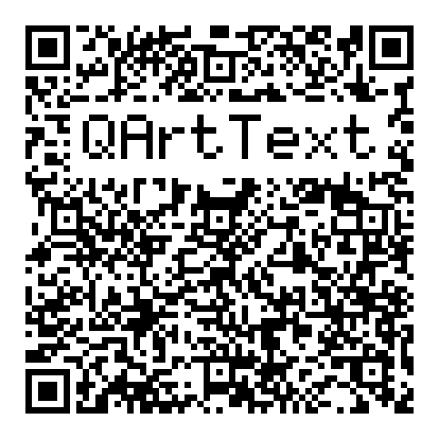

# QArtText

QR codes with what they point at written legibly inside them (a domain name,
a phone number, a network, a person, or any text you like) in a bitmap font,
and **without spending any of the error-correction redundancy**.

Named for Russ Cox's [QArt codes](https://research.swtch.com/qart), the
construction it is built on, with text in place of the picture.

Live app: open `index.html` from any static web server or go to
[qarttext.pages.dev](https://qarttext.pages.dev/). It is a progressive web
app with no external dependencies, no build step, and no network calls.

```
python3 -m http.server 8000     # then visit http://localhost:8000/
```



For technical details, see [qarttext.md](qarttext.md).

## Credits

- Russ Cox, [QArt Codes](https://research.swtch.com/qart), for the construction.

- Helena Zhang, [Departure Mono](https://departuremono.com/), for the largest
  face. `src/departure.js` is read off the font file and, unlike the rest of
  this repository, is under the
  [SIL Open Font License 1.1](https://openfontlicense.org/), whose text it carries.

The `Micro 3×5` and `Mixed 5×8` tables are original, drawn to the QR module
grid. These are the faces they are modeled on:

- [Departure Mono](https://departuremono.com/)
- [urcades/pilot](https://github.com/urcades/pilot)
- [PalmOS system fonts](https://damieng.com/typography/palmos-font/)

